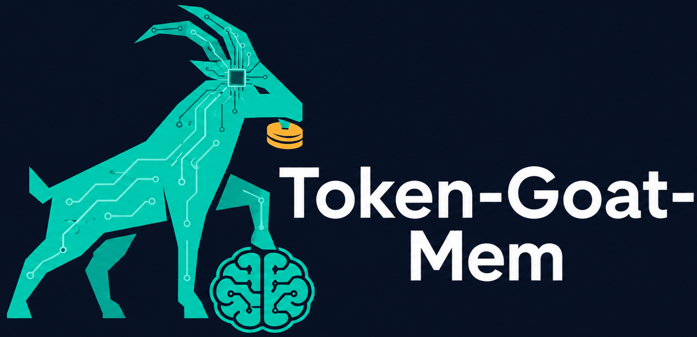

# Token-Goat Mem



**Durable memory for daily AI coding** · **1-second recall** · **Trustworthy confidence levels** · **Anchor-based freshness** · **Optional token-goat seam**

**Local-first, defense-in-depth memory that remembers what your AI coding agent keeps forgetting between sessions.**

You tell your AI "we use pnpm not npm" and it forgets. Every session. Then it runs `npm install` and corrupts the lockfile. You re-explain that you prefer 2-space indentation, and the next day it defaults to tabs. These are not oversights — the agent genuinely does not see a record of these decisions after a compaction.

Mem stores them. Locally, in your own SQLite database. Each fact carries a trust level and an anchor (a read-only predicate that tests whether the fact is still true). On recall, Mem re-validates anchors and surfaces only the facts that are fresh and trustworthy, with a confidence caveat so your agent never treats a hint as ground truth when it should not.

Works with **Claude Code**, **Copilot CLI**, **Copilot in VS Code**, **Codex**, and any agent that can run a shell command — integration guides for the first four live in [`docs/integrations/`](docs/integrations/). Optional one-way seam with [**token-goat**](https://github.com/DFKHelper/token-goat), a sister CLI that gives agents narrow-slice code/doc reads to cut context burn, for embedding memory hints into its token-reduction manifest.

**Install:**

```
npm install -g token-goat-mem
mem --help
```

**Or from source:**

```
git clone https://github.com/DFKHelper/token-goat-mem.git
cd token-goat-mem
npm install
npm run build
npm link
mem --help
```

[](LICENSE) 

> Built and maintained by [DFK Helper](https://dfkhelper.com). Free under PolyForm Noncommercial. If it saves your tokens, or your sanity, drop a star at the top of this page.

[Install](#install) · [CLI](#cli) · [Walkthrough](#walkthrough) · [How it works](#how-it-works) · [Anchors](#anchors) · [Token-goat integration](#optional-token-goat-seam) · [Disclaimer & License](#disclaimer)

---

## The problem

Your AI coding agent accumulates durable knowledge that keeps evaporating:

- **Preferences** — "uses pnpm not npm", "2-space indent", "no default exports", "tabs not spaces"
- **Decisions** — "chose Postgres over Mongo for relational queries", "auth service owns migrations"
- **Project facts** — "staging DB is at prod-staging-db-1", "CI env is GitHub Actions"
- **Corrections** — recurring "do not do X" that you repeat every session

Today this knowledge is lost at each session boundary. The agent re-asks, re-derives, or — worst — forgets and does the wrong thing. A confident wrong memory is worse than no memory at all. If Mem surfaces a stale preference as ground truth ("you use npm" three months after you switched to pnpm), your agent acts on it and corrupts your lockfile.

The defining engineering problem is not *retrieval* — it is **correctness and staleness**. Mem solves both.

## What changes

| Before | After |
|--------|-------|
| Agent re-reads the same preference every session | `stored pref (verify): uses pnpm, not npm — mem show <id>` — one-line hint with confidence |
| Agent does the wrong thing because it forgot a decision | `mem remember "Postgres chosen over Mongo for relational JOIN queries" --kind decision` persists it; `mem recall` surfaces it with provenance and age |
| Mixed signals on project setup (old README says npm, lockfile says pnpm) | Anchor predicates test the *actual state* (which lockfile is newer, git history); anchor-contradicted facts are excluded from recall and flagged in `mem review` for human resolution, never surfaced as ground truth |
| Every session starts cold | `mem recall --hint-format` embeds prior facts into your AI context at startup (~5-10 lines per session) |
| Session compaction forgets preferences | Facts live in SQLite, outside any context window; `mem pin <id>` additionally exempts a fact from time-decay. Unpinned preferences decay in confidence over time if not re-affirmed |
| Stale facts invisible until they cause damage | `mem review` flags anchor-contradicted facts before they become silent bugs |

## How it works

1. **Explicit capture** — `mem remember "uses pnpm not npm" --kind preference` stores a fact with a source reference and timestamp. `--kind` is required: `preference`, `decision`, `fact`, or `correction`.
2. **Optional anchors** — Add an anchor: `mem remember "uses pnpm" --kind preference --anchor 'file-newer-than pnpm-lock.yaml package-lock.json'`. The anchor is a read-only predicate; on recall, Mem tests it and returns one of three verdicts: `affirmed` (ground truth), `unverified` (hint to verify), or `contradicted` (suppressed, flagged in review).
3. **Recall with trust levels** — `mem recall --kind preference` returns active facts annotated by trust level, freshness verdict, and age. Low-trust facts are marked "verify" so your AI never mistakes a hint for ground truth.
4. **Review and resolution** — `mem review` lists pending, contested, and anchor-contradicted facts. Contradictions (same subject + scope, different values, ambiguous winner) are never surfaced as ground truth — they appear here for you to resolve.
5. **Forget and edit** — `mem forget <id>` soft-deletes a fact (marks it superseded, kept for audit); `mem edit <id>` updates text, subject/value, anchor, or scope. Both bump an internal epoch so the token-goat seam always sees the latest state.

## Install

**Requirements:** Node.js 18 or later

Not yet published to npm — install from source:

```
git clone https://github.com/DFKHelper/token-goat-mem.git
cd token-goat-mem
npm install
npm run build
npm link
```

No daemon, no tray icon, no setup wizard. Mem is a short-lived CLI process.

### Verify the install

```
mem --version
mem epoch
```

`mem --version` prints the installed version; `mem epoch` prints a number (creating the database on first run), which confirms the CLI and the SQLite store are wired correctly.

### Where data lives

Everything is stored in a single SQLite database at `~/.mem/mem.db`. Set `TOKEN_GOAT_MEM_HOME` to relocate it (the test suite uses this to isolate itself from your real data). No network calls, ever.

## CLI

| Command | What it does |
|---------|-------------|
| `mem remember <text>` | Store a new fact. `--kind preference\|decision\|fact\|correction` (required), `--subject <key>` + `--value <value>` (paired, for contradiction detection), `--anchor <predicate>` (optional), `--scope global\|project\|path` (default global), `--source-ref <ref>`, `--root <path>`. |
| `mem suggest <text>` | Same flags as `mem remember`, but always stores the fact `pending` (`captureSuggested`, not `captureExplicit`) — never auto-promoted, confirm via `mem review --promote <id>`. |
| `mem export` | Writes stored facts to stdout as a JSON envelope: `{ schemaVersion, exportedAt, facts }`. Pair with `mem import --from-json` for backup/restore or full-fidelity migration between stores. This is the **stable** machine-readable surface. `--kind`, `--status` (comma-separated), `--subject`, `--scope` filter which facts are exported (default: every fact, any status). |
| `mem import --from-md <path>` | **Advisory only.** Parses a markdown file (CLAUDE.md-style) for `-`/`*` bullet lines that look like preference/decision statements and imports each as a `pending`, `source_type: "derived"` fact — the same trust path as any other suggested candidate; never auto-promoted, no bulk-promote shortcut. Confirm each import via `mem review --promote <id>`. `--dry-run` (report candidates without writing), `--root <path>`, `--scope global\|project\|path` (default `project`), `--kind` (default `preference`). Re-importing the same file skips bullets already imported at the same file:line + text. |
| `mem import --from-json <path>` | **Full-fidelity.** Imports a `mem export` file, preserving each fact's original `id`, `status`, `confidence`, and `captured_at` exactly — unlike `--from-md`, an imported fact keeps whatever status it was exported with (including already-`active`), not forced to `pending`. Still runs the same secret screening before writing. Idempotent: a fact whose `id` already exists in the target store is skipped as a duplicate, safe to re-run. `--dry-run` (report candidates without writing), `--root <path>` (used only for `.mem/allowlist` resolution). Exactly one of `--from-md`/`--from-json` is required. |
| `mem recall [query]` | Retrieve facts by relevance with trust levels and freshness verdicts. Caps non-withheld results at 20 by default (a trailing `showing N of M` line appears when truncated) — pending/contested/superseded/contradicted facts are never subject to this cap, so a fact needing attention is never silently hidden. `--kind`, `--subject`, `--scope`, `--hint-format` (TGMEM/2 wire format for token-goat), `--context-files <a,b>` (scope=path matching, `--hint-format` only), `--age-days <n>`, `--limit <n>` (overrides the default 20), `--root <path>`, `--stable` (deterministic id-sorted output instead of relevance/recency order), `--hint-style <full\|terse>` (default `full`; `terse` drops the CTA and shortens kind labels to `pref`/`dec`/`fact`/`corr`), `--since-epoch <n>` (only include facts written after write-epoch `n`). Default (`full`) output ends with one trailing footer line (`mem show <id> for detail; mem review to resolve contested/pending`) instead of repeating a CTA per line. |
| `mem list` | Fact IDs and one-line summaries. Caps at 20 by default (a trailing `showing N of M` line appears when truncated). `--kind`, `--status` (comma-separated), `--subject`, `--scope`, `--limit` (overrides the default 20), `--json` (machine-readable, **unstable pre-1.0** -- shape may change; same fact shape as `mem export` minus `embedding`, plus `total`/`truncated`; use `mem export` for a stable machine-readable surface). |
| `mem show <id>` | One fact in full: text, provenance, anchor and its current freshness verdict. `--root <path>`, `--json` (machine-readable, **unstable pre-1.0**; also includes `freshness` and `sources`, which plain `mem export`/`mem list --json` do not). |
| `mem review` | Pending, contested, and anchor-contradicted facts for human resolution. `--promote <id>` / `--reject <id>` act on pending facts; `--root <path>`; `--summary` (print per-bucket counts instead of full listings); `--section <pending|contested|contradicted|pins>` (restrict output to one bucket); `--since-epoch <n>` (only include facts written after write-epoch `n`). |
| `mem forget <id>` | Soft-delete a fact (marks superseded, kept for audit) and audit-log it. Bumps epoch. |
| `mem edit <id>` | Change a fact's `--text`, `--subject`/`--value` (paired), `--anchor`, or `--scope`. Bumps epoch. |
| `mem pin <id>` | Exempt a fact from time-decay (still subject to contradiction/anchor suppression). |
| `mem epoch` | Print the current write epoch (monotonic, bumped on every write). `--gc` runs the retention pass first: persists contradiction resolutions, prunes superseded facts/sources/audit rows, applies preference decay. |
| `mem doctor` | Read-only environment/DB health check: db path, WAL journal mode, foreign-key setting, schema tables, current epoch, fact counts by status, source/audit-log row counts. No options. |
| `mem init <tool>` | Wires mem into a coding tool's config -- `claude-code`, `codex`, `copilot-cli`, or `copilot-vscode` -- automating what `docs/integrations/*.md` otherwise asks you to hand-copy. Idempotent: re-running upgrades mem's own entries in place, never duplicates them; an unstamped hand-written entry with the same identity aborts with a conflict error instead of being overwritten. `--root <path>` (project root, default current directory), `--user` (write the tool's user-level config instead of project-level, where it has both), `--dry-run` (print what would be written without touching disk). |
| `mem uninstall <tool\|--all>` | Removes exactly what `mem init` wrote for `tool` -- or every tool with `--all` -- leaving everything else untouched. A no-op (not an error) if there's nothing mem-authored to remove. `--root <path>`, `--user`, `--dry-run`. |

Every `<id>` argument (`show`, `forget`, `pin`, `edit`, `review --promote`/`--reject`) accepts a git-style short prefix — at least 4 characters — instead of the full id, as long as it uniquely identifies one fact. A prefix matching more than one fact errors and lists every match.

Every command supports `--help` for the authoritative flag list.

> **`mem import --from-json` and `scope_root`:** a `scope="project"`/`scope="path"` fact's `scopeRoot` is an absolute filesystem path from the machine it was exported on. `mem import --from-json` imports it verbatim (full fidelity), so re-importing an export from a different machine — or a different path on the same machine — leaves `scopeRoot` pointing at a path that may not exist there. This is a known v1 limitation, not something the import command tries to fix up.

## Walkthrough

Paste this into a terminal (uses a throwaway home so it never touches your real data):

```bash
export TOKEN_GOAT_MEM_HOME=$(mktemp -d)

mem remember "uses pnpm, not npm" --kind preference --subject package-manager --value pnpm
# remembered preference fact 79bce136-679f-471b-8ccb-fd18df7d2b36

mem remember "switched to bun" --kind preference --subject package-manager --value bun
# remembered preference fact 21a1330e-95d3-453c-81f0-49c792e1488f

mem recall
# stored pref (unverified, 2026-07): switched to bun
# mem show <id> for detail; mem review to resolve contested/pending
```

Both facts share the subject `package-manager` with different values — a contradiction. Recall already prefers the newer fact and hides the loser; `epoch --gc` persists that resolution:

```bash
mem epoch --gc
# epoch=3  contradictions_resolved=1  preferences_decayed_below_floor=0  pruned_superseded_facts=0  pruned_sources=0  pruned_audit_log_rows=0

mem list
# 21a1330e-...  [preference/active] package-manager=bun  switched to bun
# 79bce136-...  [preference/superseded] package-manager=pnpm  uses pnpm, not npm
```

Anchored facts are re-validated on every recall. An anchor that tests false excludes the fact from ground truth and routes it to review:

```bash
mem remember "repo has a yarn.lock" --kind fact --anchor "file-exists yarn.lock" --scope project --root .

mem recall --root . --scope project
# fact (contradicted, excluded): repo has a yarn.lock
# mem show <id> for detail; mem review to resolve contested/pending

mem review --root .
# -- anchor-contradicted (suppressed from ground truth) (1) --
# 888ba2c0-...  [fact/active]  repo has a yarn.lock
```

(IDs are random UUIDs; yours will differ.)

## Anchors

Anchors are pure, read-only filesystem/git predicates — no shell-out, no network, bounded I/O, and paths are confined to the given `--root`:

| Predicate | Affirms when |
|-----------|--------------|
| `file-exists <path>` | the file exists under root |
| `file-absent <path>` | the file does not exist |
| `file-newer-than <a> <b>` | `a` is the currently-active file relative to `b` (e.g. the newest lockfile is pnpm's) |
| `file-contains <path> <substring>` | the file contains the substring (bounded read) |
| `file-not-contains <path> <substring>` | the file does not contain the substring |
| `newest-of <expected> <candidate...>` | among `expected` plus every listed `candidate`, `expected` is the sole existing file with the greatest mtime (e.g. "the newest lockfile is pnpm-lock.yaml", not just "pnpm-lock.yaml exists") |
| `glob-exists <pattern>` | some file matches the glob (`*`, `?`, and a recursive `**` segment) |
| `git-branch-is <branch>` | the repo's current branch matches |
| `git-tracked <path>` | the path is tracked in the git index |
| `package-version <path> <name>@<version>` | `path` (a `package.json`) declares `name` at `version` in `dependencies`/`devDependencies` -- **declared-manifest check only**, not the installed/lockfile-resolved version; comparison is exact string match or major-version-prefix match only (no semver-range-satisfaction), so a genuinely ambiguous comparison is `unverified`, never a guessed `affirmed` |

Each evaluation yields `affirmed`, `unverified` (missing file, no repo, malformed predicate — cannot confirm or deny), or `contradicted`. Only `affirmed` is ground-truth eligible.

## Optional token-goat seam

Mem works standalone. When [token-goat](https://github.com/DFKHelper/token-goat) is on PATH, token-goat can call `mem recall --hint-format --root <project-root>` to embed memory hints into its token-reduction manifest.

The seam is one-directional (Mem reads nothing from token-goat), stateless (live calls, no caching), and self-caveating (display strings include their own trust caveats). Contested or low-trust facts are excluded from `--hint-format` entirely — only ground-truth-eligible or explicitly-caveated hints are emitted. Mem does not cache results; forget/edit reflect instantly. If mem is not on PATH or the call times out, token-goat falls back to no hints (fail-open).

### TGMEM wire format

`--hint-format` emits `TGMEM/2` by default: a header line, then one line per fact (`pref  fresh=affirmed|unverified|contradicted  id=<uuid>  display="<caveated text>"`), then — only when at least one fact line was emitted — a single shared footer line: `footer  mem show <id> for detail; mem review to resolve contested/pending`.

TGMEM/2 moved the per-fact follow-up hint (`mem show <id>`, `resolve via mem review`, ...) out of every `display` string and into that one footer line, since repeating the same CTA on every line was pure overhead once a consumer already knows the pattern. `display` itself is unchanged otherwise — still self-caveating, still meant to be surfaced verbatim.

`TGMEM/1` (the original format: per-line CTA baked into `display`, no footer line) remains fully supported for callers that still parse it — pass `protocolVersion: 1` to `buildHintFormat()` when calling the programmatic seam directly. The CLI itself always emits the current default version.

### Cheap polling with `mem epoch`

Re-running `mem recall --hint-format` on every host-tool turn works, but it re-opens the DB and re-runs retrieval every time even when nothing changed. `mem epoch` is the cheap alternative: it prints a single monotonic integer that is bumped by every write (`remember`, `edit`, `forget`, `pin`, `review --promote`/`--reject`, the `epoch --gc` retention pass) and left untouched otherwise. A host tool can poll it and only pay for a full `mem recall` when the value actually moved:

```bash
last_epoch=$(mem epoch)
# ... later, on each turn ...
current_epoch=$(mem epoch)
if [ "$current_epoch" != "$last_epoch" ]; then
  mem recall --hint-format --root "$project_root"
  last_epoch="$current_epoch"
fi
```

`mem epoch` with no flags never mutates state (no GC pass, no writes) — it is safe to call as often as you like as a cache-invalidation key.

## Works with

Integration guides in [`docs/integrations/`](docs/integrations/):

- [Claude Code](docs/integrations/claude-code.md)
- [Copilot CLI](docs/integrations/copilot-cli.md)
- [Copilot in VS Code](docs/integrations/copilot-vscode.md)
- [Codex](docs/integrations/codex.md)

Any other agent that can run a shell command (Cursor, Windsurf, Cline, Aider, ...) can use the same patterns: `mem recall --hint-format` at session start, `mem remember` as decisions land.

## Disclaimer

Token-Goat Mem runs on your machine and writes to your local SQLite database. The software is provided as-is, without warranty of any kind. DFK Helper LLC is not liable for any damages arising from use. Full terms, including the No Liability clause, are in the LICENSE file.

Mem stores facts you tell it to remember and suggests candidate facts for confirmation. Never persisted by default: secrets, credentials, PII, high-entropy tokens, full file contents. Enforcement layers: (a) only short extracted facts are stored; (b) secret-pattern and entropy screening; (c) suggested facts shown in `mem review` before surfacing. Local-only, zero network. Run `mem review` to audit all stored facts.

## License

Token-Goat Mem is source-available under the PolyForm Noncommercial License 1.0.0.

**Personal use:** free. Includes hobby projects, individual productivity, personal study, and private coding. Individual developers may install and use the software on their own machines for individual productivity purposes without a commercial license.

**Commercial use or shared infrastructure:** requires a license. Contact token-goat@dfkhelper.com for details.

**Patent Pending.**

Full terms in LICENSE.

---

Built and maintained by DFK Helper. If it saves your tokens or your sanity, a star means the world.
