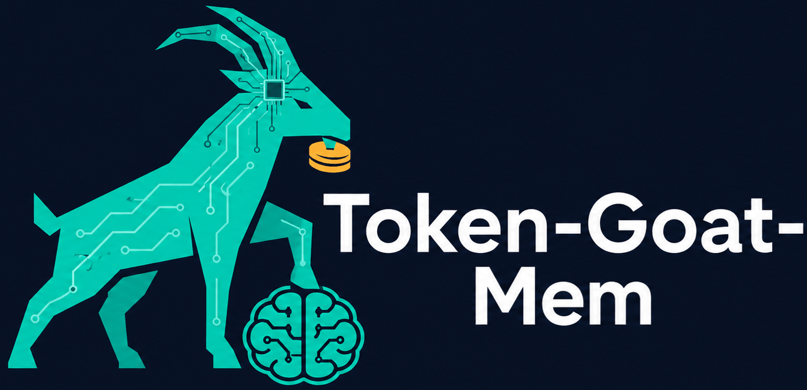

# Token-Goat Mem



**Durable memory for daily AI coding** · **1-second recall** · **Trustworthy confidence levels** · **Anchor-based freshness** · **Optional token-goat seam**

**Local-first, defense-in-depth memory that remembers what your AI coding agent keeps forgetting between sessions.**

You tell your AI "we use pnpm not npm" and it forgets. Every session. Then it runs `npm install` and corrupts the lockfile. You re-explain that you prefer 2-space indentation, and the next day it defaults to tabs. These are not oversights — the agent genuinely does not see a record of these decisions after a compaction.

Mem stores them. Locally, in your own SQLite database. Each fact carries a trust level and an anchor (a read-only predicate that tests whether the fact is still true). On recall, Mem re-validates anchors and surfaces only the facts that are fresh and trustworthy, with a confidence caveat so your agent never treats a hint as ground truth when it should not.

Works with **Claude Code**, **Copilot CLI**, **Copilot in VS Code**, **Codex**, and any agent that can run a shell command — integration guides for the first four live in [`docs/integrations/`](docs/integrations/). There is also an optional *seam* -- a one-way integration point, where the other tool calls mem and mem knows nothing about it -- with [**token-goat**](https://github.com/DFKHelper/token-goat), a sister CLI that gives agents narrow-slice code/doc reads to cut context burn. Token-goat reads `mem epoch` (a cache-invalidation key) and optionally consumes memory via the published `TGMEM/2` wire format, which a future host tool can adopt.

**Install:**

```
npm install -g token-goat-mem
mem --help
```

Building from source, requirements, and verifying the install: [Install](#install).

[](LICENSE) 

> Built and maintained by [DFK Helper](https://dfkhelper.com). Free under PolyForm Noncommercial. If it saves your tokens, or your sanity, drop a star at the top of this page.

[Install](#install) · [CLI](#cli) · [Walkthrough](#walkthrough) · [How it works](#how-it-works) · [Anchors](#anchors) · [Token-goat integration](#optional-token-goat-seam) · [Disclaimer & License](#disclaimer)

---

## The problem

Your AI coding agent accumulates durable knowledge that keeps evaporating:

- **Preferences** — "uses pnpm not npm", "2-space indent", "no default exports", "tabs not spaces"
- **Decisions** — "chose Postgres over Mongo for relational queries", "auth service owns migrations"
- **Project facts** — "staging DB is at prod-staging-db-1", "CI env is GitHub Actions"
- **Corrections** — recurring "do not do X" that you repeat every session

Today this knowledge is lost at each session boundary. The agent re-asks, re-derives, or — worst — forgets and does the wrong thing. A confident wrong memory is worse than no memory at all. If Mem surfaces a stale preference as ground truth ("you use npm" three months after you switched to pnpm), your agent acts on it and corrupts your lockfile.

The defining engineering problem is not *retrieval* — it is **correctness and staleness**. Mem solves both.

## What changes

| Before | After |
|--------|-------|
| Agent re-reads the same preference every session | `stored pref (verify): uses pnpm, not npm — mem show <id>` — one-line hint with confidence |
| Agent does the wrong thing because it forgot a decision | `mem remember "Postgres chosen over Mongo for relational JOIN queries" --kind decision` persists it; `mem recall` surfaces it with provenance and age |
| Mixed signals on project setup (old README says npm, lockfile says pnpm) | Anchor predicates test the *actual state* (which lockfile is newer, git history); anchor-contradicted facts are excluded from recall and flagged in `mem review` for human resolution, never surfaced as ground truth |
| Every session starts cold | `mem recall --hint-format` embeds prior facts into your AI context at startup (~5-10 lines per session) |
| Session compaction forgets preferences | Facts live in SQLite, outside any context window; `mem pin <id>` additionally exempts a fact from time-decay. Unpinned preferences decay in confidence over time if not re-affirmed |
| Stale facts invisible until they cause damage | `mem review` flags anchor-contradicted facts before they become silent bugs |

## How it works

1. **Explicit capture** — `mem remember "uses pnpm not npm" --kind preference` stores a fact with a source reference (`source_ref`: where the fact came from, such as the command or file that produced it -- not to be confused with the separate `sources` table `mem show --json` exposes, which is designed to hold redacted content previews and is not yet written to by any capture path) and timestamp. `--kind` is required: `preference`, `decision`, `fact`, or `correction`. Saying the same thing again reaffirms the existing fact rather than writing a second row: `captured_at` and confidence are refreshed, and the command prints `reaffirmed` instead of `remembered`. Matching is deterministic and conservative -- same normalized text (case folded, whitespace collapsed, one trailing period dropped), same kind, same scope binding, same subject and value -- so identical text carrying a *different* value stays two facts for contradiction resolution to key on. Only live facts match: a `pending` one is never reaffirmed (that would promote it without review), a `superseded` one is never resurrected, and `mem suggest` never reaffirms at all, since derived text must not refresh a fact the user did not restate.
2. **Optional anchors** — Add an anchor: `mem remember "uses pnpm" --kind preference --anchor 'file-newer-than pnpm-lock.yaml package-lock.json'`. The anchor is a read-only predicate; on recall, Mem tests it and returns one of three verdicts: `affirmed` (ground truth), `unverified` (hint to verify), or `contradicted` (suppressed, flagged in review).
3. **Recall with trust levels** — `mem recall --kind preference` returns active facts annotated by trust level, freshness verdict, and age. Low-trust facts are marked "verify" so your AI never mistakes a hint for ground truth.
4. **Review and resolution** — `mem review` lists pending, contested, and anchor-contradicted facts. The two words are different mechanisms and both appear throughout: *contested* is fact-versus-fact (two facts disagree with each other, and neither clearly wins), while *contradicted* is fact-versus-world (an anchor predicate tested reality and denied the fact). A fact can be either without being the other. Contradictions (same subject + scope, different values, ambiguous winner) are never surfaced as ground truth — they appear here for you to resolve. Resolution runs both ways: once the rival is forgotten or edited into agreement, the next `mem epoch --gc` reinstates the survivor (back to `pinned` if it was pinned) instead of leaving it withheld.
5. **Forget and edit** — `mem forget <id>` soft-deletes a fact (marks it superseded, kept for audit); `mem edit <id>` updates text, subject/value, anchor, or scope. Both bump an internal epoch so the token-goat seam always sees the latest state.

## Install

**Requirements:** Node.js 18 or later

```
npm install -g token-goat-mem
```

Or from source:

```
git clone https://github.com/DFKHelper/token-goat-mem.git
cd token-goat-mem
npm install
npm run build
npm link
```

No daemon, no tray icon, no setup wizard. Mem is a short-lived CLI process.

### Verify the install

```
mem --version
mem epoch
```

`mem --version` prints the installed version; `mem epoch` prints a number (creating the database on first run), which confirms the CLI and the SQLite store are wired correctly.

### Where data lives

Everything is stored in a single SQLite database at `~/.mem/mem.db`. Set `TOKEN_GOAT_MEM_HOME` to relocate it (the test suite uses this to isolate itself from your real data). No network calls, ever.

On POSIX systems the directory is created `0700` and the database `0600`, so the store is readable only by you even on a shared machine -- and an existing home created by an earlier version is tightened on the next run. Windows relies on the ACL `~/.mem` inherits from your user profile, which restricts it the same way.

## CLI

| Command | What it does |
|---------|-------------|
| `mem remember <text>` | Store a new fact. `--kind preference\|decision\|fact\|correction` (required), `--subject <key>` + `--value <value>` (paired, for contradiction detection), `--anchor <predicate>` (optional), `--scope global\|project\|path` (default global), `--source-ref <ref>`, `--root <path>`, `--path <file>` (required when `--scope path`, rejected otherwise — the file/directory the fact binds to, resolved against `--root`; without it a `--scope path` fact would bind to `--root` itself, i.e. behave exactly like `--scope project`). |
| `mem suggest <text>` | Same flags as `mem remember`, but always stores the fact `pending` (`captureSuggested`, not `captureExplicit`) — never auto-promoted, confirm via `mem review --promote <id>`. |
| `mem scan-session` | Scan a session transcript for durable-statement sentences and file each as `pending` — the capture half of the Claude Code seam, installed by `mem init` as a `Stop` hook. Deterministic sentence matching against a fixed opener table (`remember that`, `from now on`, `always`/`never`, `don't`, `we decided`, `we should`/`let's` + `always`/`never`, `decision:`, `rule:`), no model, so the same transcript always yields the same candidates. An opener must still be the first thing said, past a closed list of discourse fillers (`please`, `also`, `so`, `ok`, `note that`) that may precede it — enough to catch "Please always run the linter", not enough to let "I never got that to work" through. The stored text is the whole sentence, filler included. Nothing reaches `active` without `mem review --promote <id>`, and the dedup matches on fact text so a rejected suggestion is never re-filed by a later scan. Only the human's own text is read: tool results, `<system-reminder>` injections, slash-command payloads, relayed subagent reports, and compaction summaries are all stored under the user role and are all excluded. `--hook-stdin` (take `transcript_path` from a hook envelope), `--transcript <path>` (scan a named file instead), `--root <path>`, `--scope global\|project\|path` (default `project`), `--quiet` (emit nothing on success — a `Stop` hook's stdout would otherwise land in the session it just read). |
| `mem export` | Writes stored facts to stdout as a JSON envelope: `{ schemaVersion, exportedAt, facts }`. Pair with `mem import --from-json` for backup/restore or full-fidelity migration between stores. This is the **stable** machine-readable surface. `--kind`, `--status` (comma-separated), `--subject`, `--scope` filter which facts are exported (default: every fact, any status). |
| `mem import --from-md <path>` | **Advisory only.** Parses a markdown file (CLAUDE.md-style) for `-`/`*` bullet lines that look like preference/decision statements and imports each as a `pending`, `source_type: "derived"` fact — the same trust path as any other suggested candidate; never auto-promoted, no bulk-promote shortcut. Confirm each import via `mem review --promote <id>`. `--dry-run` (report candidates without writing), `--root <path>`, `--scope global\|project\|path` (default `project`), `--kind` (default `preference`), `--path <file>` (required when `--scope path`, rejected otherwise — every bullet in this run binds to the same file/directory). Re-importing the same file skips bullets already imported at the same file:line + text. `--captured-at <iso>` back-dates every fact in the run to when the file was actually written (`--captured-at "$(git log -1 --format=%aI -- CLAUDE.md)"`) instead of now; a malformed or future value fails the whole run with exit 1 rather than being reported per bullet. |
| `mem import --from-json <path>` | **Full-fidelity.** Imports a `mem export` file, preserving each fact's original `id`, `status`, `confidence`, and `captured_at` exactly — unlike `--from-md`, an imported fact keeps whatever status it was exported with (including already-`active`), not forced to `pending`. Still runs the same secret screening before writing. Idempotent: a fact whose `id` already exists in the target store is skipped as a duplicate, safe to re-run. `--dry-run` (report candidates without writing), `--root <path>` (used only for `.mem/allowlist` resolution). Exactly one of `--from-md`/`--from-json` is required. |
| `mem recall [query]` | Retrieve facts by relevance with trust levels and freshness verdicts. Caps non-withheld results at 20 by default (a trailing `showing N of M` line appears when truncated) — pending/contested/contradicted facts are never subject to this cap, so a fact needing attention is never silently hidden. `--kind`, `--subject`, `--scope`, `--hint-format` (TGMEM/2 wire format for token-goat), `--context-files <a,b>` (scope=path matching, `--hint-format` only), `--age-days <n>`, `--limit <n>` (overrides the default 20), `--root <path>` (facts are bound to the project they were captured in: a `project`-scoped fact surfaces only from its own root, a `path`-scoped one only from a root containing its file, and `global` facts from anywhere), `--stable` (deterministic id-sorted output instead of relevance/recency order), `--hint-style <full\|terse>` (default `full`; `terse` drops the CTA and shortens kind labels to `pref`/`dec`/`fact`/`corr`), `--since-epoch <n>` (only include facts written after write-epoch `n`), `--entity <value>` (only facts carrying that extracted entity -- a file path, CLI flag, constant, version, or identifier -- matched case-insensitively; **repeatable, and repeats AND together**, so `--entity src/cli.ts --entity --hint-format` keeps only facts mentioning both; see `mem facets --list-entities` for what is available, and note it cannot be combined with `--hint-format`). Default (`full`) output ends with one trailing footer line (`mem show <id> for detail; mem review to resolve contested/pending`) instead of repeating a CTA per line. Ranking also consults the entity layer without any flag: identifiers in the query itself are matched against stored entities and fused as one more rank list, because BM25 stems `src/retrieval.ts` down to `src`/`retriev`/`ts` and cannot otherwise tell the fact naming that file from one merely using those three words. It is a vote and not an override -- a fact that only carries the identifier will not displace one that carries it and matches the rest of the query -- and it is silent for a query containing no identifier at all. |
| `mem list` | Fact IDs and one-line summaries. Caps at 20 by default (a trailing `showing N of M` line appears when truncated). `--kind`, `--status` (comma-separated), `--subject`, `--scope`, `--limit` (overrides the default 20), `--json` (machine-readable, **unstable pre-1.0** -- shape may change; same fact shape as `mem export` minus `embedding`, plus `total`/`truncated`; use `mem export` for a stable machine-readable surface). |
| `mem show <id>` | One fact in full: text, provenance, anchor and its current freshness verdict. `--root <path>`, `--json` (machine-readable, **unstable pre-1.0**; adds a `freshness` verdict that plain `mem export`/`mem list --json` do not, plus a reserved `sources` array that is **always empty** -- no capture path writes source rows, so `[]` means mem records no sources at all, not that this fact has none). Also prints `history`: every audit row for the fact, oldest first. That is where an edited fact's previous text lives -- `mem edit` overwrites in place, so nothing else in the store retains it. |
| `mem review` | Pending, contested, anchor-contradicted, and unanchored-but-checkable facts for human resolution. `--promote <id>` / `--reject <id>` act on pending **and contested** facts — promoting a contested fact resolves the contradiction in its favor and supersedes its rivals, rejecting one reinstates the survivor; `--undo <id>` reverses a `--reject`, restoring the fact to the status it had before (rejections only -- `mem forget` is a considered decision, not a review slip, and is refused by name); `--root <path>`; `--summary` (print per-bucket counts instead of full listings); `--section <pending\|contested\|contradicted\|pins\|unanchored>` (restrict output to one bucket); `--since-epoch <n>` (only include facts written after write-epoch `n`). |
| `mem forget <id>` | Soft-delete a fact (marks superseded, kept for audit) and audit-log it. Bumps epoch. |
| `mem edit <id>` | Change a fact's `--text`, `--subject`/`--value` (paired), `--anchor`, `--scope`, or (when rebinding to `--scope path`) `--path <file>` (required when `--scope path` is given, rejected otherwise). Bumps epoch. |
| `mem pin <id>` | Exempt a fact from time-decay (still subject to contradiction/anchor suppression). Only an active (or already-pinned) fact can be pinned: pinning is a promotion to maximal trust, so a `pending`, `contested`, or `superseded` fact must be resolved through `mem review` first rather than pinned around it. |
| `mem used <id...> --session-id <id>` | Record that facts recalled in a session were actually useful. Feeds recall ranking as a third rank list fused alongside BM25 (rank-based, so the signal cannot drift as the store grows). `--session-id` is required and names the session the recall was surfaced under (`mem recall --hint-format --session-id <id>`, or the hook envelope's `session_id`) -- mem is a short-lived process with no notion of a current session. Naming a fact never surfaced in that session says so and exits 0 rather than failing. Idempotent: marking twice does not double-count. Does not bump epoch (no fact's content, status, or freshness changes). |
| `mem epoch` | Print the current write epoch (monotonic, bumped on every write). `--gc` runs the retention pass first: persists contradiction resolutions, prunes superseded facts/sources/audit rows, applies preference decay. |
| `mem consolidate` | Report facts that restate each other, so a store that has accreted three phrasings of one preference can collapse to one. Deterministic and offline: clusters by Jaccard similarity over the `fact_terms` topic layer (`mem facets`), never a model call. Only facts of the same kind and the same scope binding are ever compared. **Dry run by default** -- bare `mem consolidate` prints the clusters and changes nothing; `--apply` marks every loser `superseded` (soft-delete, audit-logged, kept in the store), keeping the pinned member, else the most confident, else the newest. A pinned fact is never superseded, only listed. `--threshold <0-1>` sets the Jaccard floor (default `0.5`: at that floor two facts must share more of their combined topic vocabulary than they differ on, which separates restatements from facts that merely discuss the same subject; the measure is scale-free, so unlike a BM25 score the same number means the same thing however large the store grows). `--stale` runs the other pass instead: `active` facts older than `--stale-days <n>` (default `90`) that recall has never surfaced and nobody has ever marked useful, same dry-run-then-`--apply` contract. Neither pass ever hard-deletes anything. |
| `mem dream` | Report what a configured model thinks follows from several stored facts taken together -- the inference `mem consolidate` deliberately cannot do, since Jaccard over topic terms can see that two facts restate each other but never that a third thing follows from both. **An evaluation surface, not a capture path:** it writes nothing, and there is no flag that makes it -- the output is a report to read, and anything worth keeping is kept by typing `mem remember`. Off unless `TOKEN_GOAT_MEM_DREAM_URL` (an OpenAI-compatible chat-completions endpoint) and `TOKEN_GOAT_MEM_DREAM_MODEL` are set; `TOKEN_GOAT_MEM_DREAM_API_KEY` is optional, so a local endpoint that wants no auth is sent no header. **This is the only command that sends fact text off this machine** -- point it at a local model if the store holds anything you would not paste into a hosted API. Sends `active` and `pinned` facts only, newest first, capped at 200 (a superseded fact is one the store has already decided is wrong, and an inference resting on it would carry the store's authority behind a retracted premise). Every returned candidate is checked before it is printed: it must cite at least two of the facts that were actually sent, by an index that resolves, and must not restate a fact already stored -- a candidate failing any of these is dropped rather than shown, so each printed `from:` id is one `mem show` can open. See [Optional: `mem dream`](#optional-mem-dream). `--timeout <ms>` (default 60000), `--json`. Deliberately has no `--root`: dreaming reasons over the whole live store, and a flag that read as scoping while doing nothing would be worse than no flag. |
| `mem facets` | Extract, inspect, and list the structured entity/topic terms behind `mem recall --entity`. Terms are written automatically on capture and re-written on `mem edit`, so this command is for backfill and inspection, not routine use. No flags (or `--backfill`) extracts terms for facts that have none yet and reports the counts; `--all` re-extracts every fact -- the path after an extraction-rule change; `--fact <id>` shows one fact's entities and topics (short id prefixes work); `--list-entities` prints the distinct entities in the store with fact counts, most frequent first. Entities are stored with the spelling the fact used and matched case-insensitively, so `--entity postgresql` finds a fact that says `PostgreSQL`. The three modes are mutually exclusive. |
| `mem embed` | Compute and store embedding vectors for facts, so recall can rank semantically as well as lexically. Requires `TOKEN_GOAT_MEM_EMBED_URL` and `TOKEN_GOAT_MEM_EMBED_MODEL` (see [Optional: semantic recall](#optional-semantic-recall)) and errors naming them when unset. Default: embeds only facts that have no vector yet, in batches, and reports `embedded / skipped / failed`. `--all` re-embeds every fact and rewrites the recorded model -- the migration path after changing models. `--limit <n>` bounds the work. A failed batch costs only that batch; a run in which nothing was embedded exits non-zero. |
| `mem doctor` | Read-only environment/DB health check: db path, WAL journal mode, foreign-key setting, schema tables, current epoch, fact counts by status, source/audit-log row counts, embedding configuration (endpoint host and model -- never the API key) and coverage. No options. |
| `mem init <tool>` | Wires mem into a coding tool's config -- `claude-code`, `codex`, `copilot-cli`, or `copilot-vscode` -- automating what `docs/integrations/*.md` otherwise asks you to hand-copy. Idempotent: re-running upgrades mem's own entries in place, never duplicates them; an unstamped hand-written entry with the same identity aborts with a conflict error instead of being overwritten. `--root <path>` (project root, default current directory), `--user` (write the tool's user-level config instead of project-level, where it has both), `--dry-run` (print what would be written without touching disk). |
| `mem uninstall <tool\|--all>` | Removes exactly what `mem init` wrote for `tool` -- or every tool with `--all` -- leaving everything else untouched. A no-op (not an error) if there's nothing mem-authored to remove. `--root <path>`, `--user`, `--dry-run`. |

Every `<id>` argument (`show`, `forget`, `pin`, `edit`, `used`, `review --promote`/`--reject`) accepts a git-style short prefix — at least 4 characters — instead of the full id, as long as it uniquely identifies one fact. A prefix matching more than one fact errors and lists every match.

Every command supports `--help` for the authoritative flag list.

### Optional: semantic recall

Retrieval is BM25 (lexical) by default and needs no configuration. Point these at any
OpenAI-compatible embeddings endpoint -- OpenAI, Ollama, LM Studio, LiteLLM -- and recall additionally
ranks by meaning, fusing the two lists with Reciprocal Rank Fusion:

| Variable | |
| --- | --- |
| `TOKEN_GOAT_MEM_EMBED_URL` | Full endpoint, e.g. `http://localhost:11434/v1/embeddings`. Setting it is what turns the feature on. |
| `TOKEN_GOAT_MEM_EMBED_MODEL` | Model name. Required whenever the URL is set. |
| `TOKEN_GOAT_MEM_EMBED_API_KEY` | Optional. Sent as `Authorization: Bearer <key>`; never logged, echoed, or printed by `mem doctor`. |

A localhost endpoint keeps mem's zero-network property; a hosted one does not, and sends your fact
text to that provider. Nothing is sent until you set the URL.

Once configured, `mem remember` and `mem suggest` embed each new fact in the background of the same
command -- after secret screening, never before -- and never fail, slow, or change their output if
the endpoint is down. Run `mem embed` once to backfill facts captured earlier.

Vectors from two different models are not comparable, and cosine similarity cannot detect the
mismatch: it happily compares them and returns a confident, meaningless number. Mem records which
model produced the store's vectors and refuses to rank against them when the configured model
differs, saying so on `mem recall` and `mem doctor`. `mem embed --all` is the migration.

### Optional: `mem dream`

`mem consolidate` can tell that two facts restate each other; it structurally cannot tell that a
third thing follows from both, because Jaccard over topic terms has no notion of entailment.
`mem dream` asks a model that question and prints the answer. Same shape as semantic recall above --
off until you set the URL, any OpenAI-compatible chat-completions endpoint:

| Variable | |
| --- | --- |
| `TOKEN_GOAT_MEM_DREAM_URL` | Full endpoint, e.g. `http://localhost:11434/v1/chat/completions`. Setting it is what turns the command on. |
| `TOKEN_GOAT_MEM_DREAM_MODEL` | Model name. Required whenever the URL is set. |
| `TOKEN_GOAT_MEM_DREAM_API_KEY` | Optional. Sent as `Authorization: Bearer <key>` only when set, so a local endpoint that wants no auth receives no header. Never logged or echoed; errors name the endpoint host, never its URL or key. |

**It writes nothing, and no flag makes it.** The output is a report; anything in it worth keeping is
kept by typing `mem remember`, which runs the same secret screening, anchoring, and contradiction
checks every other fact goes through. That is the whole design: a model is allowed to suggest what
might follow from the store, and is never allowed to add to it.

**It is the only command that sends fact text off this machine.** Semantic recall sends fact text to
an embeddings endpoint on capture; dreaming sends it to a chat model on demand. Point it at a local
model if the store holds anything you would not paste into a hosted API.

Only `active` and `pinned` facts are sent, newest first, capped at 200 -- a superseded fact is one
the store has already decided is wrong, and an inference resting on it would carry the store's
authority behind a retracted premise. The reply is treated as untrusted input rather than as an
answer: a candidate must cite at least two of the facts actually sent, by an index that resolves,
and must not restate a fact already stored. One that fails any check is dropped rather than printed,
so every `from:` id is one `mem show` opens.

```
$ mem dream
dream: qwen3:8b via localhost  facts_sent=34
2 candidate inference(s) -- nothing was written; this is a report
  [fact] deployment is entirely manual end to end
    from: 3f2a... 9c14...
```

> **`mem import --from-json` and `scope_root`:** a `scope="project"`/`scope="path"` fact's `scopeRoot` is an absolute filesystem path from the machine it was exported on. `mem import --from-json` imports it verbatim (full fidelity), so re-importing an export from a different machine — or a different path on the same machine — leaves `scopeRoot` pointing at a path that may not exist there. For a `scope="project"` fact captured inside a git checkout with a remote, the `scope_repo` identity below covers that case and the fact still surfaces; a `scope="path"` fact, or a project fact from a checkout with no remote, still binds to the path alone.

> **Project identity (`scope_repo`):** a `scope="project"` fact captured inside a git checkout also
> records `<normalized remote>#<root relative to the working tree>`, so it surfaces from a second
> clone of the same repository, from a git worktree, and after an export/import onto another
> machine. The subpath half is what keeps a monorepo honest: one remote, many project roots, so
> `packages/a` and `packages/b` are different projects and neither sees the other's decisions.
> Identity only ever *widens* recall — the absolute-path binding is checked first and unchanged, and
> a fact with no identity (captured before this existed, or in a checkout with no unambiguous
> remote) is matched by path exactly as before. Reading is local and read-only: `git` is never
> invoked, only `.git`'s own files are parsed. Set `TOKEN_GOAT_MEM_PROJECT_IDENTITY=path` to opt out
> and keep the path-only binding at both capture and recall — the case for it is two clones that are
> deliberately *not* the same project, such as a fork kept for experiments.
>
> Contradiction resolution deliberately still keys on `scope_root`, not `scope_repo`: that key
> decides the persisted `superseded`/`contested` transitions, there is no honest backfill for facts
> captured before identities existed, and widening it would rewrite facts across checkouts on the
> first `mem epoch --gc` after upgrade. The cost is stated plainly — two facts on one subject
> captured in two clones are both in scope and are not detected as rivals.

## Walkthrough

Paste this into a terminal (uses a throwaway home so it never touches your real data):

```bash
export TOKEN_GOAT_MEM_HOME=$(mktemp -d)

mem remember "uses pnpm, not npm" --kind preference --subject package-manager --value pnpm
# remembered preference fact 79bce136-679f-471b-8ccb-fd18df7d2b36

mem remember "switched to bun" --kind preference --subject package-manager --value bun
# remembered preference fact 21a1330e-95d3-453c-81f0-49c792e1488f

mem recall
# stored pref (unverified, 2026-07): switched to bun
# mem show <id> for detail; mem review to resolve contested/pending
```

Both facts share the subject `package-manager` with different values — a contradiction. Recall already prefers the newer fact and hides the loser; `epoch --gc` persists that resolution:

```bash
mem epoch --gc
# epoch=3  contradictions_resolved=1  preferences_decayed_below_floor=0  pruned_superseded_facts=0  pruned_sources=0  pruned_audit_log_rows=0  pruned_recall_log_rows=0

mem list
# 21a1330e-...  [preference/active] package-manager=bun  switched to bun
# 79bce136-...  [preference/superseded] package-manager=pnpm  uses pnpm, not npm
```

Anchored facts are re-validated on every recall. An anchor that tests false excludes the fact from ground truth and routes it to review:

```bash
mem remember "repo has a yarn.lock" --kind fact --anchor "file-exists yarn.lock" --scope project --root .

mem recall --root . --scope project
# fact (contradicted, excluded): repo has a yarn.lock
# mem show <id> for detail; mem review to resolve contested/pending

mem review --root .
# -- anchor-contradicted (suppressed from ground truth) (1) --
# 888ba2c0-...  [fact/active]  repo has a yarn.lock
```

(IDs are random UUIDs; yours will differ.)

## Anchors

Anchors are pure, read-only filesystem/git predicates — no shell-out, no network, bounded I/O, and paths are confined to the given `--root`:

| Predicate | Affirms when |
|-----------|--------------|
| `file-exists <path>` | the file exists under root |
| `file-absent <path>` | the file does not exist |
| `file-newer-than <a> <b>` | `a` is the currently-active file relative to `b` (e.g. the newest lockfile is pnpm's) |
| `file-contains <path> <substring>` | the file contains the substring (bounded read) |
| `file-not-contains <path> <substring>` | the file does not contain the substring |
| `newest-of <expected> <candidate...>` | among `expected` plus every listed `candidate`, `expected` is the sole existing file with the greatest mtime (e.g. "the newest lockfile is pnpm-lock.yaml", not just "pnpm-lock.yaml exists") |
| `glob-exists <pattern>` | some file matches the glob (`*`, `?`, and a recursive `**` segment) |
| `git-branch-is <branch>` | the repo's current branch matches |
| `git-tracked <path>` | the path is tracked in the git index |
| `valid-until <ISO date>` | the date has not passed. The one predicate that reads no filesystem or git state -- for a fact that is true until a date rather than until a file changes ("until the v2 migration lands, keep the shim"). A bare `YYYY-MM-DD` is read as the end of that day, so `valid-until 2026-12-31` is still affirmed during the 31st; an unparseable date is rejected at capture rather than silently reading as expired |
| `package-version <path> <name>@<version>` | `path` (a `package.json`) declares `name` at `version` in `dependencies`/`devDependencies` -- **declared-manifest check only**, not the installed/lockfile-resolved version; comparison is exact string match or major-version-prefix match only (no semver-range-satisfaction), so a genuinely ambiguous comparison is `unverified`, never a guessed `affirmed` |

Each evaluation yields `affirmed`, `unverified` (missing file, no repo, malformed predicate — cannot confirm or deny), or `contradicted`. Only `affirmed` is ground-truth eligible.

## Optional token-goat seam

Mem works standalone. When [token-goat](https://github.com/DFKHelper/token-goat) is on PATH, token-goat reads `mem epoch` (a monotonic integer) to invalidate its compaction cache. The `TGMEM/2` wire format is published as an optional seam � a future host tool *can* call `mem recall --hint-format --root <project-root>` to embed memory hints into its own manifest, but no tool consumes it today.

The seam is one-directional (Mem reads nothing from token-goat), stateless (live calls, no caching), and self-caveating (display strings include their own trust caveats). Contested or low-trust facts are excluded from `--hint-format` entirely — only ground-truth-eligible or explicitly-caveated hints are emitted. Mem does not cache results; forget/edit reflect instantly. If mem is not on PATH or the call times out, token-goat falls back to no hints (fail-open).

### TGMEM wire format

`--hint-format` emits `TGMEM/2` by default: a header line, then one line per fact (`pref  fresh=affirmed|unverified|contradicted  id=<uuid>  display="<caveated text>"`), then — only when at least one fact line was emitted — a single shared footer line: `footer  mem show <id> for detail; mem review to resolve contested/pending`.

TGMEM/2 moved the per-fact follow-up hint (`mem show <id>`, `resolve via mem review`, ...) out of every `display` string and into that one footer line, since repeating the same CTA on every line was pure overhead once a consumer already knows the pattern. `display` itself is unchanged otherwise — still self-caveating, still meant to be surfaced verbatim.

`TGMEM/1` (the original format: per-line CTA baked into `display`, no footer line) remains fully supported for callers that still parse it — pass `protocolVersion: 1` to `buildHintFormat()` when calling the programmatic seam directly. The CLI itself always emits the current default version.

### Cheap polling with `mem epoch`

Re-running `mem recall --hint-format` on every host-tool turn works, but it re-opens the DB and re-runs retrieval every time even when nothing changed. `mem epoch` is the cheap alternative: it prints a single monotonic integer that is bumped by every write (`remember`, `edit`, `forget`, `pin`, `review --promote`/`--reject`, the `epoch --gc` retention pass) and left untouched otherwise.

A host tool can use `mem epoch` to detect store changes and only re-run `mem recall` when the store actually changed. However, **the epoch covers store writes only** — it does not cover anchor verdicts (filesystem and git state, re-evaluated live on every recall) or preference decay (a function of time). A polling consumer should therefore either call `mem recall` on a time interval to refresh anchors and decay, or monitor for working-tree events (branch switches, dependency installs) that may invalidate anchors.

**Store-only polling pattern** (refreshes store state only):
```bash
last_epoch=$(mem epoch)
# ... later, on each turn ...
current_epoch=$(mem epoch)
if [ "$current_epoch" != "$last_epoch" ]; then
  mem recall --hint-format --root "$project_root"
  last_epoch="$current_epoch"
fi
```

**Time-interval pattern** (refreshes all state including anchors and decay):
```bash
last_recall=$(date +%s)
# ... on each turn ...
now=$(date +%s)
if [ $((now - last_recall)) -gt 300 ]; then  # 5 minutes
  mem recall --hint-format --root "$project_root"
  last_recall=$now
fi
```

`mem epoch` with no flags never mutates facts (no GC pass, no writes) — it is safe to call as often as you like as a cheap store-state check.

## Works with

Integration guides in [`docs/integrations/`](docs/integrations/):

- [Claude Code](docs/integrations/claude-code.md)
- [Copilot CLI](docs/integrations/copilot-cli.md)
- [Copilot in VS Code](docs/integrations/copilot-vscode.md)
- [Codex](docs/integrations/codex.md)

Any other agent that can run a shell command (Cursor, Windsurf, Cline, Aider, ...) can use the same patterns: `mem recall --hint-format` at session start, `mem remember` as decisions land.

## Disclaimer

Token-Goat Mem runs on your machine and writes to your local SQLite database. The software is provided as-is, without warranty of any kind. DFK Helper LLC is not liable for any damages arising from use. Full terms, including the No Liability clause, are in the LICENSE file.

Mem stores facts you tell it to remember and suggests candidate facts for confirmation. Never persisted by default: secrets, credentials, PII, high-entropy tokens, full file contents. Enforcement layers: (a) only short extracted facts are stored; (b) secret-pattern and entropy screening; (c) suggested facts shown in `mem review` before surfacing. Local-only, zero network. Run `mem review` to audit all stored facts.

## License

Token-Goat Mem is source-available under the PolyForm Noncommercial License 1.0.0.

**Personal use:** free. Includes hobby projects, individual productivity, personal study, and private coding. Individual developers may install and use the software on their own machines for individual productivity purposes without a commercial license.

**Commercial use or shared infrastructure:** requires a license. Contact token-goat@dfkhelper.com for details.

**Patent Pending.**

Full terms in LICENSE.

---

Built and maintained by DFK Helper. If it saves your tokens or your sanity, a star means the world.
